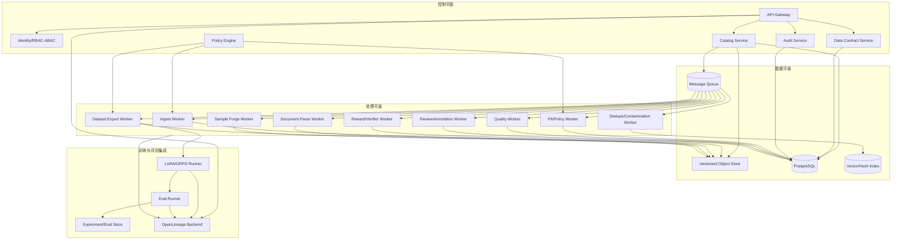

# 军事领域长链推理数据平台：开发人员系统设计方案

**版本**：0.2
**日期**：2026-09-09
**文档类型**：Developer-Oriented System Design

## 1. 设计前提

本系统服务于**军事领域**，处理经授权的战前训练与战备准备、战时保障记录、战后复盘、联合演训、多军兵种协同以及有人/无人平台资料。系统不自动生成目标选择、部署、战术、武器、指挥控制或行动规划结果；涉及战时的资料必须经过用途审批、人工复核和审计。

系统分为两条训练数据出口：

- **LoRA 数据出口**：领域继续预训练和监督适配；
- **GRPO 数据出口**：基于可验证奖励的受控后训练。

平台本身只负责数据制备、数据治理、评测、血缘和训练运行登记；模型训练由批准的训练运行器执行，不能反向访问原始受限资产。

## 2. 设计目标与非目标

### 2.1 设计目标

- 支持文本、HTML、PDF、扫描图像、表格和图文交错页面；
- 每个派生对象可追溯到原始资产、许可证、处理步骤和审批；
- 数据契约提供 schema、freshness、quality 三类断言；
- PII 和敏感用途检查默认阻断/隔离；
- 训练/评测污染检测覆盖词面、语义和视觉层；
- LoRA 数据包、GRPO episode、RewardSpec 可重建和回放；
- OpenLineage 事件覆盖导入、解析、快照、训练、评测、撤回；
- 支持内网/离线部署、可观测、可恢复和可审计；
- 生产 trace 先形成独立评测集，禁止直接进入训练。

### 2.2 非目标

- 不提供军事行动决策或建议，支持的是训练、保障、维修、医疗、通信、复盘和证据化审阅；
- 不提供实时传感器、情报、定位、目标或武器接口；允许接入经过授权的历史/脱敏记录作为训练或复盘证据；
- 不绕过任何授权、版权、访问控制或安全审查；
- 不在平台内实现通用智能体执行器或开放网络自动浏览；
- 不默认上传文件、提示、日志或模型输出到外部 API。

## 3. 总体架构



## 4. 服务边界

| 服务 | 负责 | 不负责 | 主要存储 |
|---|---|---|---|
| `catalog-service` | SourceAsset、版本、许可、内容对象、快照 | 执行 OCR/模型训练 | PostgreSQL + Object Store |
| `policy-service` | 用途、敏感等级、PII、阻断/隔离策略 | 替代人工合规责任 | PostgreSQL |
| `contract-service` | schema/freshness/quality assertions 和生命周期 | 直接修改样本内容 | PostgreSQL |
| `ingest-service` | 上传/清单导入、哈希、原件入库 | 未授权外部爬取 | Object Store |
| `parse-service` | OCR、版面、表格、图片、HTML 顺序 | 决定最终训练采纳 | Object Store + PostgreSQL |
| `quality-service` | 格式、语言、置信度、图文一致、质量评分 | 修改原件 | PostgreSQL + Vector Index |
| `dedupe-service` | exact/near/semantic/visual/contamination | 删除未经版本化数据 | Vector/Hash Index |
| `review-service` | 审核队列、标注、仲裁、黄金集 | 更改授权凭证 | PostgreSQL |
| `sample-service` | 监督样本、证据引用、合成样本 | 绕过政策门禁 | Object Store + PostgreSQL |
| `reward-service` | candidate group、verifier、RewardSpec、回放 | 自动决定高风险用途 | PostgreSQL + Object Store |
| `dataset-service` | 快照、manifest、分割、导出、审批 | 访问测试标签 | Object Store + PostgreSQL |
| `run-service` | 训练/评测登记、参数、工件和状态 | 直接读原始资产 | PostgreSQL + MLflow |
| `lineage-service` | OpenLineage 事件、血缘查询、影响分析 | 暴露原始正文 | OpenLineage Backend |
| `audit-service` | 追加型审计、导出、策略覆盖、撤回 | 删除历史审计记录 | Append-only Store |

服务之间通过版本化 API 和事件总线协作；禁止跨服务直接访问其他服务的数据库表。

## 5. 领域对象与数据库设计

以下为 PostgreSQL 逻辑 DDL 级字段建议。生产环境需要按组织数据库规范补充分区、索引、加密和审计策略。

### 5.1 来源与资产

```sql
CREATE TABLE source_asset (
    asset_id UUID PRIMARY KEY,
    source_uri TEXT,
    provider TEXT NOT NULL,
    source_type TEXT NOT NULL,
    raw_object_uri TEXT NOT NULL,
    raw_sha256 CHAR(64) NOT NULL,
    license_id UUID,
    authorization_id TEXT,
    allowed_use TEXT NOT NULL,
    sensitivity_tier TEXT NOT NULL,
    military_scope TEXT NOT NULL,
    operation_phase TEXT NOT NULL,
    service_domains JSONB NOT NULL,
    platform_mode TEXT NOT NULL,
    human_authority TEXT NOT NULL,
    retention_until TIMESTAMPTZ,
    lifecycle_status TEXT NOT NULL,
    owner_subject TEXT NOT NULL,
    created_at TIMESTAMPTZ NOT NULL,
    withdrawn_at TIMESTAMPTZ,
    UNIQUE (raw_sha256, source_uri)
);

CREATE TABLE asset_version (
    version_id UUID PRIMARY KEY,
    asset_id UUID NOT NULL REFERENCES source_asset(asset_id),
    parent_version_id UUID REFERENCES asset_version(version_id),
    transform_name TEXT NOT NULL,
    transform_version TEXT NOT NULL,
    manifest_uri TEXT NOT NULL,
    content_sha256 CHAR(64) NOT NULL,
    policy_snapshot_sha256 CHAR(64) NOT NULL,
    created_by TEXT NOT NULL,
    created_at TIMESTAMPTZ NOT NULL
);
```

`military_scope` 枚举建议：`military_training_readiness`、`wartime_support_record`、`joint_service_coordination`、`manned_unmanned_systems`、`restricted_pending_review`、`prohibited_operational`。`operation_phase` 使用 `preparation`、`wartime_support`、`post_event_review`；`service_domains` 使用 `land`、`naval`、`air`、`joint_support`、`medical`、`communications`；`platform_mode` 使用 `manned`、`unmanned`、`manned_unmanned_team`。禁止类别只能进入隔离表和审计，不能进入 `dataset_version`。

### 5.2 内容、解析与 PII

```sql
CREATE TABLE content_object (
    content_id UUID PRIMARY KEY,
    version_id UUID NOT NULL REFERENCES asset_version(version_id),
    modality TEXT NOT NULL,
    language TEXT,
    content_uri TEXT NOT NULL,
    normalized_sha256 CHAR(64) NOT NULL,
    parser_id TEXT NOT NULL,
    parser_version TEXT NOT NULL,
    parser_confidence NUMERIC(6,5),
    locator_json JSONB NOT NULL,
    status TEXT NOT NULL,
    created_at TIMESTAMPTZ NOT NULL
);

CREATE TABLE pii_finding (
    finding_id UUID PRIMARY KEY,
    content_id UUID NOT NULL REFERENCES content_object(content_id),
    entity_type TEXT NOT NULL,
    locator_json JSONB NOT NULL,
    confidence NUMERIC(6,5) NOT NULL,
    detector_id TEXT NOT NULL,
    detector_version TEXT NOT NULL,
    action TEXT NOT NULL,
    review_state TEXT NOT NULL,
    reviewer_subject TEXT,
    reviewed_at TIMESTAMPTZ
);
```

PII `action`：`typed_placeholder`、`image_redaction`、`column_mask`、`quarantine`、`allow_with_approval`。自动检测结果不能视为完备识别；黄金集 precision/recall 未达门槛时，禁止自动发布。

### 5.3 数据契约、质量与血缘

```sql
CREATE TABLE data_contract (
    contract_id UUID PRIMARY KEY,
    contract_name TEXT NOT NULL,
    contract_version TEXT NOT NULL,
    lifecycle_state TEXT NOT NULL, -- PENDING/ACTIVE/RETIRED
    schema_assertions JSONB NOT NULL,
    freshness_assertions JSONB NOT NULL,
    quality_assertions JSONB NOT NULL,
    failure_policy JSONB NOT NULL,
    created_by TEXT NOT NULL,
    created_at TIMESTAMPTZ NOT NULL,
    UNIQUE (contract_name, contract_version)
);

CREATE TABLE quality_check (
    check_id UUID PRIMARY KEY,
    object_id UUID NOT NULL,
    contract_id UUID NOT NULL REFERENCES data_contract(contract_id),
    assertion_type TEXT NOT NULL,
    assertion_name TEXT NOT NULL,
    result TEXT NOT NULL,
    observed_value JSONB,
    threshold JSONB,
    severity TEXT NOT NULL,
    evidence_uri TEXT,
    created_at TIMESTAMPTZ NOT NULL
);

CREATE TABLE lineage_run (
    run_id UUID PRIMARY KEY,
    job_namespace TEXT NOT NULL,
    job_name TEXT NOT NULL,
    openlineage_run_id UUID NOT NULL,
    processing_type TEXT NOT NULL,
    status TEXT NOT NULL,
    input_refs JSONB NOT NULL,
    output_refs JSONB,
    code_commit TEXT,
    config_sha256 CHAR(64),
    started_at TIMESTAMPTZ,
    completed_at TIMESTAMPTZ
);
```

断言生命周期：`PENDING` 只观测和记录；`ACTIVE` 才有阻断权；`RETIRED` 不用于新数据，但历史结果仍可回放。

### 5.4 样本、GRPO 与训练运行

```sql
CREATE TABLE dataset_version (
    dataset_id UUID PRIMARY KEY,
    purpose TEXT NOT NULL, -- LORA/GRPO/EVAL
    version TEXT NOT NULL,
    manifest_uri TEXT NOT NULL,
    manifest_sha256 CHAR(64) NOT NULL,
    contract_id UUID NOT NULL REFERENCES data_contract(contract_id),
    split_hashes JSONB NOT NULL,
    exclusion_report_uri TEXT NOT NULL,
    approval_state TEXT NOT NULL,
    approved_by TEXT,
    approved_at TIMESTAMPTZ,
    UNIQUE (purpose, version)
);

CREATE TABLE reward_spec (
    reward_spec_id UUID PRIMARY KEY,
    name TEXT NOT NULL,
    version TEXT NOT NULL,
    verifier_refs JSONB NOT NULL,
    judge_model_ref TEXT,
    judge_prompt_uri TEXT,
    reward_weights JSONB NOT NULL,
    thresholds JSONB NOT NULL,
    hard_constraints JSONB NOT NULL,
    rollout_config JSONB NOT NULL,
    reference_policy_ref TEXT NOT NULL,
    created_at TIMESTAMPTZ NOT NULL,
    UNIQUE (name, version)
);

CREATE TABLE grpo_episode (
    episode_id UUID PRIMARY KEY,
    dataset_id UUID NOT NULL REFERENCES dataset_version(dataset_id),
    prompt_ref TEXT NOT NULL,
    context_refs JSONB NOT NULL,
    candidate_group_id UUID NOT NULL,
    reward_spec_id UUID NOT NULL REFERENCES reward_spec(reward_spec_id),
    candidates JSONB NOT NULL,
    verifier_results JSONB NOT NULL,
    reward_vector JSONB NOT NULL,
    scalar_rewards JSONB NOT NULL,
    replay_hash CHAR(64) NOT NULL,
    created_at TIMESTAMPTZ NOT NULL
);

CREATE TABLE training_run (
    training_run_id UUID PRIMARY KEY,
    dataset_id UUID NOT NULL REFERENCES dataset_version(dataset_id),
    base_model_ref TEXT NOT NULL,
    adapter_config JSONB,
    reward_spec_id UUID REFERENCES reward_spec(reward_spec_id),
    train_config JSONB NOT NULL,
    code_commit TEXT NOT NULL,
    image_digest TEXT NOT NULL,
    seed INTEGER NOT NULL,
    status TEXT NOT NULL,
    output_artifact_uri TEXT,
    metrics_uri TEXT,
    created_at TIMESTAMPTZ NOT NULL
);
```

## 6. 状态机与业务规则

### 6.1 资产状态

```text
REGISTERED
  -> LICENSE_VERIFIED
  -> INGESTED
  -> NORMALIZED
  -> POLICY_CHECKED
  -> QUALITY_CHECKED
  -> REVIEW_PENDING | CANDIDATE
  -> WITHDRAWN | QUARANTINED
```

规则：

- 没有 `LICENSE_VERIFIED` 不能进入解析或样本构造；
- `prohibited_operational` 只能进入 `QUARANTINED`；
- 任何 PII 高敏或低置信命中必须 `REVIEW_PENDING`；
- 撤回资产和派生对象必须阻断新导出。

### 6.2 数据集状态

```text
DRAFT -> CONTRACT_CHECKED -> CONTAMINATION_CHECKED
      -> REVIEWED -> VERSION_FROZEN -> APPROVED -> EXPORTED
      -> REJECTED | WITHDRAWN
```

`EXPORTED` 之后不得修改内容；需要修订必须创建新版本。

### 6.3 GRPO episode 状态

```text
PROMPT_APPROVED -> ROLLOUT_CREATED -> VERIFIED
                -> REWARD_COMPUTED -> HUMAN_REVIEW_IF_NEEDED
                -> REPLAYABLE -> INCLUDED_IN_DATASET
                -> QUARANTINED | REJECTED
```

零方差候选组、验证器异常、硬约束失败或组内 prompt 不一致的 episode 不得作为有效正向更新样本。

## 7. API 设计

### 7.1 API 约定

- URL 前缀 `/api/v1`；
- 使用 JSON；大文件使用预签名 URL，但预签名操作由平台生成且有用途/过期时间；
- 每个写请求必须带 `Idempotency-Key`、`X-Actor-Subject` 和 `X-Purpose`；
- 所有响应带 `request_id`、`trace_id` 和 `policy_snapshot`；
- 404 不泄露受限资源存在性；
- 测试标签、原件正文和 PII 字段按角色过滤。

### 7.2 来源导入

```http
POST /api/v1/assets
Idempotency-Key: asset-import-<hash>
Content-Type: application/json

{
  "provider": "approved_provider",
  "source_uri": "approved://document/123",
  "source_type": "pdf",
  "license_id": "lic-001",
  "authorization_id": "auth-2026-001",
  "allowed_use": "military_training_and_readiness_support",
  "military_scope": "military_training_readiness",
  "operation_phase": "preparation",
  "service_domains": ["joint_support"],
  "platform_mode": "manned_unmanned_team",
  "human_authority": "review_required",
  "retention_until": "2027-09-08T00:00:00Z",
  "object_sha256": "..."
}
```

响应：`202 Accepted`，返回 `asset_id`、作业 ID 和当前策略判定。未授权返回隔离状态，不生成可训练对象。

### 7.3 数据契约校验

```http
POST /api/v1/datasets/{dataset_id}/contract-check

{
  "contract_id": "contract-uuid",
  "assertion_mode": "active",
  "fail_policy_override": null
}
```

禁止调用方通过请求体降低 ACTIVE 契约阈值；任何策略覆盖必须单独审批并写审计。

### 7.4 导出 LoRA/GRPO

```http
POST /api/v1/datasets/{dataset_id}/exports

{
  "export_type": "LORA|GRPO",
  "format": "jsonl|parquet",
  "base_model_ref": "approved/model@sha256:...",
  "adapter_config": {
    "target_modules": ["q_proj", "v_proj"],
    "rank": 16,
    "alpha": 32,
    "dropout": 0.05
  },
  "reward_spec_id": null,
  "purpose": "military_training_and_readiness_support"
}
```

导出前执行权限、授权、合同、质量、污染、PII、撤回和审批检查；未通过返回结构化 `blocked_reasons`。

### 7.5 生产 trace 回流

```http
POST /api/v1/evaluation-datasets/from-traces

{
  "trace_query": {
    "source_type": "production",
    "risk_tier": ["low", "medium"],
    "quality_score_max": 0.7
  },
  "redaction_profile": "trace-v1",
  "target_eval_snapshot": "eval-2026-09-v2"
}
```

该 API 只创建独立评测数据集记录，不创建训练样本。训练候选转换需要新的人工审批和数据版本。

## 8. 异步作业和事件设计

### 8.1 事件类型

```text
asset.registered
asset.ingested
asset.parsed
policy.checked
pii.detected
quality.checked
dedupe.completed
review.requested
review.completed
sample.built
dataset.contract_checked
dataset.frozen
dataset.approved
dataset.exported
reward.replayed
training.started
training.completed
evaluation.completed
asset.withdrawn
```

事件信封：

```json
{
  "event_id": "uuid",
  "event_type": "dataset.frozen",
  "event_version": "1",
  "occurred_at": "2026-09-08T00:00:00Z",
  "producer": "dataset-service@sha256:...",
  "request_id": "uuid",
  "actor_subject": "service-account",
  "purpose": "military_training_and_readiness_support",
  "entity_ref": "dataset:uuid",
  "entity_sha256": "...",
  "payload": {}
}
```

事件 payload 只携带 ID、哈希、版本和最小指标，不携带原始受限正文、PII 或测试标签。

### 8.2 OpenLineage 事件规则

- 每个批处理 Job 必须发送 `START`；
- 正常结束发送 `COMPLETE`；失败发送 `FAIL`；人为中止发送 `ABORT`；
- 输入和输出包含 Dataset namespace/name、版本和 schema facet；
- Job facet 写代码仓库和 commit，Run facet 写配置 hash、执行器和资源；
- 所有事件使用 UUID runId，终态事件后不得继续发送同一 Run 的普通生命周期事件；
- 撤回影响分析使用 Dataset/Run/Job 图查询，不读取历史原始正文。

## 9. 作业可靠性设计

### 9.1 幂等

幂等键建议：

- 导入：`raw_sha256 + import_profile_version`；
- 解析：`asset_version_id + parser_id + parser_version + options_hash`；
- 去重：`snapshot_id + detector_version`；
- 导出：`dataset_id + export_type + config_sha256`；
- 回放：`episode_id + reward_spec_id + verifier_bundle_sha256`。

重复请求返回原作业结果，不创建重复对象。

### 9.2 重试与隔离

- 可重试：网络短暂异常、队列超时、临时 GPU 不可用；
- 不可盲目重试：策略阻断、许可证过期、schema 失败、污染命中；
- 失败作业保留输入/输出 hash、错误分类和最后阶段；
- 超过重试次数进入死信队列，由工程师或审核员处理；
- 原件和冻结快照采用写一次/新版本写入策略。

### 9.3 资源限制

- 文档最大页数、文件大小、OCR 像素、表格单元和超时均可配置；
- CPU/GPU Worker 按队列隔离；
- 训练 Worker 不具备原始对象库访问权限；
- 远程服务开关默认关闭，开启必须带审批 ID 和过期时间；
- 任务临时文件使用加密卷并在完成/失败后清理。

## 10. 权限与数据安全

### 10.1 权限矩阵

| 操作 | 数据管理员 | 数据工程师 | 标注员 | 训练工程师 | 合规审核员 | 审计员 |
|---|---:|---:|---:|---:|---:|---:|
| 登记来源/许可 | R/W | R | - | - | A | R |
| 查看原件 | 按授权 | 受限 | 脱敏 | - | 按授权 | - |
| 修改解析派生 | - | R/W | - | - | R | R |
| 标注/仲裁 | - | R | R/W | - | A | R |
| 创建 LoRA/GRPO 包 | - | R | - | R/W | A | R |
| 导出训练包 | A | R | - | R | A | R |
| 修改策略 | R | - | - | - | R/W | R |
| 撤回/冻结 | R/W | R | - | R | A | R |

`A` 表示审批/最终授权；实际组织可叠加数据级别、项目和用途属性策略。

### 10.2 安全控制

- SSO/MFA、短期服务凭据和最小权限；
- 对象存储、数据库备份、消息队列和传输链路加密；
- 密钥不写入 Git、日志或数据包；
- 原件、脱敏派生对象、训练包和测试标签分层存储；
- 审计日志追加写入、定期导出到不可变存储并校验哈希链；
- CI/CD 执行依赖漏洞扫描、SBOM、镜像签名、许可证检查和秘密扫描；
- 生产 trace、提示、输出和日志默认脱敏，访问需要用途声明。

## 11. 可观测性

### 11.1 指标

```text
ingest_success_total
parse_latency_seconds
parse_failure_total
ocr_confidence_histogram
table_structure_f1
pii_high_risk_block_total
pii_review_rate
dedupe_exact_rate
dedupe_near_rate
contamination_hit_total
review_queue_age_seconds
annotation_agreement
contract_assertion_fail_total
export_block_total
lora_rebuild_match_rate
grepo_episode_replay_rate
reward_zero_variance_rate
reward_override_rate
kl_drift
training_cost_gpu_hours
evaluation_gain_per_cost
withdrawal_impact_count
```

### 11.2 日志字段

`timestamp, service, request_id, trace_id, actor_subject, purpose, asset_id/dataset_id/run_id, policy_version, contract_version, code_commit, action, decision, reason_codes, latency, error_class`

日志不得包含原始 PII、完整提示、测试答案或未授权军事资料正文。

### 11.3 告警

P0：未授权/禁止用途发布、评测污染、PII 高敏自动放行、审计链断裂、数据越权。
P1：GRPO 奖励塌缩、数据契约阻断率突增、撤回影响未处理、训练包不可重建、OpenLineage 事件缺失。
P2：解析延迟、队列积压、OCR 低置信率波动、GPU 成本超预算。

## 12. 测试设计

### 12.1 单元测试

- policy decision table；
- PII 发现到三种处置策略映射；
- 数据契约断言和失败等级；
- manifest/hash 计算；
- RewardSpec 加权、硬约束和零方差判断；
- 状态机非法转移；
- OpenLineage 事件 schema。

### 12.2 集成测试

- 登记 -> 导入 -> 解析 -> 质量 -> 审核 -> 快照 -> 导出全链路；
- PDF 多栏/扫描件/表格/图文交错页面回放；
- 训练/评测词面、语义、视觉近重复；
- LoRA 数据包重建；
- GRPO episode 固定验证器回放；
- 生产 trace 脱敏 -> eval snapshot -> 人工审批 -> 训练候选隔离；
- 撤回影响图；
- OpenLineage START/COMPLETE/FAIL/ABORT。

### 12.3 安全和非功能测试

- RBAC/ABAC 越权、对象 ID 枚举、预签名 URL 过期；
- 内网禁网构建、远程服务 opt-in、容器逃逸与临时文件清理；
- 幂等、重试、死信和恢复；
- 数据库备份、对象存储版本恢复和审计完整性；
- 负载、队列积压、GPU 资源隔离；
- 供应链漏洞、镜像签名、SBOM 和许可证检查。

## 13. CI/CD 和开发流程

### 13.1 仓库建议

```text
repo/
  services/
    catalog/
    policy/
    parse/
    quality/
    dedupe/
    review/
    sample/
    reward/
    dataset/
    run/
    lineage/
    audit/
  packages/
    contracts/
    event-schema/
    policy-sdk/
    lineage-sdk/
  migrations/
  workflows/
  deployment/
    helm/
    kustomize/
  tests/
    fixtures/
    golden-set/
  docs/
  sbom/
```

### 13.2 Pipeline 阶段

1. 格式、静态检查、类型检查；
2. 单元和契约测试；
3. 数据契约 schema 校验；
4. 容器构建、SBOM、漏洞、许可证和秘密扫描；
5. 覆盖战前、战时保障、战后复盘、多军兵种和有人/无人协同的授权黄金集集成测试；
6. 离线构建/离线模型加载测试；
7. 部署到开发环境，执行端到端回放；
8. 需要批准的测试环境和生产发布；
9. 发布后 smoke test、指标和回滚点确认。

### 13.3 代码规则

- 所有 schema、策略、RewardSpec、模型、解析器和数据集均语义化版本；
- API 与事件向后兼容，破坏性变化必须升级主版本；
- 每个新规则都要有正例、负例、边界例和回归例；
- 所有外部依赖固定版本和 hash；
- 任何默认打开远程服务的代码变更视为高风险变更；
- 禁止把真实敏感资料放入测试 fixture 或 Git。

## 14. 开发任务拆分

### Sprint/批次 D1：底座

- PostgreSQL migrations、对象存储适配、事件信封、审计；
- IAM/RBAC 中间件、用途声明和数据级别拦截；
- OpenLineage client、作业基类、幂等和重试库。

### D2：资产与解析

- SourceAsset/License/AssetVersion API；
- 导入 Worker、哈希和版本化对象；
- Docling/PaddleOCR adapter、离线模型加载、解析结果 schema；
- PDF/HTML/图像/表格黄金集。

### D3：策略与质量

- Policy engine、PII finding、脱敏策略；
- Quality/Contract assertion runner；
- exact/near/semantic/visual dedupe；
- 污染检测报告和隔离队列。

### D4：审核与样本

- review queue、标注、仲裁、golden set；
- evidence span、监督模板、合成数据谱系；
- 多模态 media reference 和样本 manifest。

### D5：训练数据与评测

- LoRA exporter、GRPO episode、RewardSpec；
- verifier sandbox、reward replay、零方差/漂移指标；
- MLflow eval snapshot 和 trace 回流审批；
- 训练/评测 run registry。

### D6：生产化

- Kubernetes/Helm、备份、监控、告警；
- 供应链和离线 CI；
- 撤回影响图、灾备、权限和安全测试；
- 运行手册、开发手册、验收报告。

## 15. 开发完成定义（Definition of Done）

一个功能只有同时满足以下条件才算完成：

- 需求 ID、API/schema、数据库迁移和代码已关联；
- 有单元、集成、异常和权限测试；
- 通过经授权、脱敏并覆盖上述军事场景的黄金集；
- 写入日志、指标、审计和血缘；
- 能在离线环境构建或明确记录外部依赖；
- 有回滚/撤回处理；
- 文档、变更记录和版本号已更新；
- 合规/安全影响已评估；
- 不新增任何作战化或敏感处理能力。
