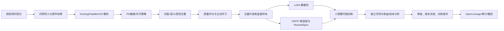

# 军事领域长链推理训练数据技术调研与选型报告

**版本**：0.2
**日期**：2026-09-09
**读者**：项目负责人、数据架构师、模型训练工程师、平台开发工程师、合规与安全审核人员

## 1. 项目定位与安全边界

本报告针对**军事领域长链推理大模型**的数据制备平台，覆盖战前准备、战时保障、战后复盘和联合演训等阶段，明确支持以下受控范围：

- 经组织批准、来源可追溯、许可或授权明确的军事训练、战备、保障和复盘资料；
- 公开教材、规范、历史档案、科研资料、装备维护、医疗救援、通信和后勤保障的通用知识、文档理解和审阅辅助；
- 文本、扫描文档、图像、图表、表格和图文交错页面的归档、解析、检索、问答和训练数据治理；
- LoRA 领域适配与 GRPO 可验证奖励后训练的数据工程。

本平台支持陆海空等多军兵种、联合保障条线，以及有人、无人和有人/无人协同平台的资料对齐与质量核验；战时数据仅用于授权的保障记录、维修医疗、通信和复盘。平台不支持实时目标识别/选择、兵力部署、武器使用、战术行动生成、指挥控制、未经授权情报收集或任何能够直接提升现实伤害能力的任务。数据处理的默认结果是“隔离、拒绝、转人工或转为边界说明”，而不是自动放行。

## 2. 调研问题

本次深化调研围绕五个问题展开：

1. 如何用较小的样本和计算预算筛出真正有训练增益的数据？
2. 如何处理军事领域常见的长文档、扫描件、表格、图文交错页面和版本差异？
3. 如何让 LoRA 与 GRPO 的数据结构可复现、可回放和可撤回？
4. 如何防止训练/指令微调/合成数据污染评测集？
5. 如何在内网、受限网络或离线环境中完成可审计的工程交付？

## 3. 结论摘要

### 3.1 结论一：数据策展优先于盲目扩大规模

**文献事实**：DataComp-LM（DCLM）提供 240T token 候选池、412M 至 7B 多个模型规模和 53 项下游评测；其基线研究认为，基于模型的过滤是构建高质量训练集的关键。DCLM-Baseline 用 2.6T token 训练 7B 模型，在 MMLU 5-shot 达到约 64%，相对 MAP-Neo 提升 6.6 个百分点，并使用少 40% 的计算量。

**工程决策**：本项目采用“固定基座、固定训练预算、固定评测集，只改变数据配方”的小规模代理实验。只有在数据策略排名、合规门禁和成本指标同时通过后，才扩大数据规模。

**来源**：Li et al., *DataComp-LM*, https://arxiv.org/abs/2406.11794；NeurIPS 论文 PDF：https://proceedings.neurips.cc/paper_files/paper/2024/file/19e4ea30dded58259665db375885e412-Paper-Datasets_and_Benchmarks_Track.pdf

### 3.2 结论二：长文档应保留版面和证据定位

**公开组件事实**：Docling 支持 PDF、Office、HTML、图像等输入，可恢复阅读顺序、表格结构、图片、公式和页级来源；支持本地模型和显式远程服务开关。PaddleOCR PP-Structure 支持文档方向校正、版面分析、表格识别、OCR、关键实体/关系抽取和版面恢复，并可模块化部署。

**工程决策**：采用“原始页面视觉索引 + OCR/结构化文本索引”双轨模型。每个 token、版面块、表格单元、图片和图注均保留页码/坐标/来源版本。远程模型服务默认关闭，离线环境预下载并固定模型工件。

**来源**：Docling 官方文档，https://docling-project.github.io/docling/usage/advanced_options/；PaddleOCR PP-Structure，https://www.paddleocr.ai/v3.0.2/en/version2.x/ppstructure/overview.html

### 3.3 结论三：GRPO 数据必须围绕“候选组 + 可复验奖励”组织

**文献与框架事实**：DeepSeekMath 将 GRPO 描述为使用同一问题的一组输出，通过组内奖励估计相对优势，减少对 value model 的依赖。Hugging Face TRL 的 GRPOTrainer 支持多个 reward function、加权奖励、PEFT/LoRA，并支持文本和部分视觉语言模型；多模态训练需要避免截断图像 token，并可从小 batch、量化和 LoRA 开始。

**工程决策**：平台固化 `RewardSpec`，包括规则、judge 模型、提示词、权重、阈值、硬约束、组大小、温度、随机种子、rollout 版本和参考策略版本。逐候选保留分项奖励、验证器证据、总奖励、分组统计和训练日志。

**来源**：Shao et al., *DeepSeekMath*, https://arxiv.org/abs/2402.03300；TRL 官方文档，https://huggingface.co/docs/trl/grpo_trainer

### 3.4 结论四：评测污染检测不能只有 n-gram

**文献事实**：Samuel、Zhou、Zou 对多种现代污染检测方法进行比较，指出现有方法有非平凡局限；指令微调中的答案扩充污染较难检测，不同方法的一致性有限。

**工程决策**：训练、SFT、GRPO、合成数据和评测数据分层隔离，执行词面、语义和视觉三层检测；使用独立的新鲜集和隐藏集做回归，任何疑似污染进入隔离，不以“未被单一检测器命中”作为清洁证明。

**来源**：Samuel et al., *Towards Data Contamination Detection for Modern LLMs*, https://arxiv.org/abs/2409.09927

### 3.5 结论五：去标识化是风险管理，不是简单打码

**官方事实**：NIST SP 800-188 要求先明确去标识化目标、数据共享模型和披露风险；可采用去除标识符、变换准标识符、合成数据或受保护环境等方式，并建议设置披露审查责任、可测标准和再识别测试。

**工程决策**：PII 发现记录到实体、位置、置信度、检测器版本、处置动作和人工复核状态；文本采用类型化占位符，图像采用区域涂抹，结构化数据采用列/单元格掩码。低置信、高敏和组合准标识符命中必须人工审核或阻断。

**来源**：NIST SP 800-188，https://csrc.nist.gov/pubs/sp/800/188/final

### 3.6 结论六：血缘采用标准事件，避免平台锁定

**官方事实**：OpenLineage 将 Job、Run、Dataset 和 Facet 组织为事件模型；批处理通常发出 `START` 后跟 `COMPLETE`、`FAIL` 或 `ABORT`，终态事件结束该 Run。

**工程决策**：导入、解析、去重、标注导出、数据快照、LoRA 训练、GRPO 训练、评测和撤回影响分析都发 OpenLineage 兼容事件，并把 Git commit、规则版本、模型版本、输入/输出清单和 schema facet 写入事件。

**来源**：OpenLineage Run Cycle，https://openlineage.io/docs/spec/run-cycle

### 3.7 结论七：生产回流先进入独立评测集

**官方事实**：MLflow 支持从生产 trace 选择样本创建评测数据集、附加 expectations、维护数据集来源与版本，可用于回归和问题样本分析；需要 SQL backend。

**工程决策**：生产 trace 先脱敏、抽样、风险筛选、人工确认，再进入独立评测快照。只有通过评测和数据 steward 审批后，才可复制为训练候选；生产数据不得自动进入训练集。

**来源**：MLflow Evaluation Datasets，https://mlflow.org/docs/latest/genai/datasets/

## 4. 技术路线与选型

### 4.1 总体技术路线

### 4.2 选型矩阵

| 能力 | 首选 | 备选 | 选型理由 | 约束 |
|---|---|---|---|---|
| 文档解析 | Docling + 本地 OCR | PaddleOCR PP-Structure | Docling 适合统一文档对象和页级 provenance；PaddleOCR 适合中文/复杂版面和表格模块化 | 必须离线预下载模型，远程服务显式 opt-in；需用项目黄金集测 CER/WER、表格 F1。 |
| 数据断言 | Great Expectations 风格的自研断言层 | DataHub Data Contract | 需要 schema/freshness/quality 和阻断/隔离/告警动作 | 断言版本必须进入 manifest。 |
| 血缘 | OpenLineage + Marquez 或兼容后端 | 直接写 PostgreSQL 图 | 标准化 Job/Run/Dataset/Facet，便于替换编排器 | 事件不可带原始敏感正文，只带引用、哈希和最小元数据。 |
| 实验/评测 | MLflow Tracking + SQL backend | 自研实验表 | 支持 trace -> eval dataset、expectation、回归集和模型版本 | 禁止自动把生产 trace 直接变成训练集。 |
| GRPO | Hugging Face TRL GRPOTrainer | veRL/OpenRLHF 适配器 | 支持多个 reward、PEFT/LoRA 和部分 VLM；开发成本较低 | 对具体模型和视觉 token 截断需建立兼容性测试。 |
| 对象存储 | S3 兼容对象存储 | 文件系统封装 | 支持版本化、不可变工件和生命周期策略 | 内网部署、加密、审计、撤回 tombstone。 |
| 元数据 | PostgreSQL | 国产关系数据库适配层 | 适合事务、审批、契约和审计索引 | 不把对象大文件和原始敏感正文存入关系表。 |
| 任务编排 | Argo Workflows/Airflow 适配层 | Temporal | 批处理 DAG 和重试能力成熟 | 每个 Job/Run 发标准血缘事件。 |
| 计算 | Kubernetes Worker + CPU/GPU 队列 | 单机批处理 | 分离 OCR、embedding、训练和评测资源 | MVP 可先单租户、批处理，后续扩展多租户。 |

### 4.3 组件选型的决策规则

- 选型必须在已批准、脱敏且覆盖军事阶段与有人/无人平台的黄金集上验证，而不是只看开源项目榜单；
- 任何会向外部网络发送用户数据的组件默认不启用；
- 组件的许可证、模型权重许可证、商标和依赖链进入软件供应链台账；
- 任何模型或规则升级都创建新版本并重跑最小回归集；
- 所有性能数字只作为候选基线，不直接承诺项目 SLO。

## 5. 数据制备配方

### 5.1 文本数据

1. 来源白名单与许可证/用途核验；
2. 语言、编码、乱码、格式和文档长度检测；
3. 结构保留：标题、章节、条目、脚注、引用、版本号；
4. 精确哈希、MinHash/片段去重、评测污染检测；
5. 领域相关性和质量模型评分；
6. 小模型代理训练；
7. 通过门禁后生成领域语料或证据型监督样本。

### 5.2 多模态文档

- 保存页面图像、OCR token、bbox、置信度、阅读顺序、表格单元关系和图注；
- HTML 保留 DOM 顺序、相邻段落和图像上下文；
- 图像执行尺寸、清晰度、人脸/个人信息、视觉近重复和图文一致性检查；
- 表格输出结构化 JSON/Parquet，同时保留原始页面作为证据；
- OCR 低置信和结构冲突进入主动审核，不静默修正。

### 5.3 LoRA 阶段

- 训练目标：术语覆盖、文体适应、文档结构、证据引用、图文理解、格式遵循；
- 数据包：`messages/input/response/media_refs/evidence_refs/metadata`；
- 绑定：基座模型版本、LoRA rank/alpha/target modules、tokenization/truncation、数据集 manifest 和评测集；
- 分层：按任务、模态、来源和许可分层切分，防止一个来源或一个模板支配数据分布。

### 5.4 GRPO 阶段

- 输入：已批准 prompt 与允许使用的证据上下文；
- 候选：同一 prompt 的固定 group size、多温度/seed 策略、完整候选记录；
- 验证：schema、引用存在性、证据支持、事实一致、边界遵守；
- 奖励：向量奖励 + 硬约束；保留原始分项奖励和人工覆盖；
- 训练：固定 RewardSpec、参考策略、rollout 配置和版本化容器；
- 监测：零方差组比例、奖励塌缩、KL 漂移、人工推翻率、独立评测收益。

## 6. 成本效率模型

### 6.1 成本构成

`C_total = C_source + C_parse + C_filter + C_label + C_storage + C_train + C_eval + C_audit + C_rework`

其中：

- `C_source`：来源登记、授权和审查；
- `C_parse`：下载、OCR、版面、表格和 embedding；
- `C_filter`：规则、模型和人工复核；
- `C_label`：标注、仲裁和黄金集；
- `C_storage`：原件、派生对象、日志、快照和备份；
- `C_train`：LoRA/GRPO 训练与 checkpoint；
- `C_eval`：代理实验、独立评测和回归；
- `C_audit`：审计、撤回和安全复核；
- `C_rework`：错误数据造成的返工。

### 6.2 数据策略评分

对每个数据配方 `p` 定义：

`Score(p) = (ΔEval(p) × Coverage(p) × Compliance(p)) / C_total(p)`

其中：

- `ΔEval`：相对基线的独立评测增益；
- `Coverage`：任务、模态、难度、来源和长尾覆盖；
- `Compliance`：授权、隐私、审计、撤回和污染门禁的乘积项；任何硬阻断使其为 0；
- `C_total`：全生命周期成本。

### 6.3 低成本试验门槛

- 每轮只改变一个主要数据变量；
- 固定基座、训练 token/样本曝光、LoRA 配置、seed 范围和评测集；
- 先使用 1/10 至 1/100 的候选规模做策略淘汰；
- 只有策略排名稳定、质量指标不回归且成本受控，才进入扩大实验；
- 任何看似高收益但污染/授权/验证不完整的策略直接淘汰。

## 7. 技术风险与待验证假设

| 假设/风险 | 影响 | 验证方法 | 退出条件 |
|---|---|---|---|
| 模型型领域过滤器能泛化到新来源 | 领域覆盖下降或漏放噪声 | 新来源分层抽样、人工黄金集、跨域 PR/RE | 漏放或误杀超过门槛时换模型/提升人工抽检。 |
| OCR/表格结构足以支持训练 | 错误证据进入 LoRA/GRPO | CER/WER、表格结构 F1、证据问答准确率 | 关键字段不达标则只保留图像并隔离文本。 |
| 三层污染检测覆盖改写、翻译、裁切 | 评测失真 | 词面/语义/视觉检测器交叉和隐藏集 | 任一高影响命中需冻结版本并重建。 |
| judge/reward 稳定 | GRPO 奖励投机 | 独立人工集、规则验证、跨版本重放 | 人工推翻率/奖励漂移超标则暂停 RL。 |
| 组件满足内网/离线要求 | 数据外泄或构建不可复现 | 禁网构建、模型工件 hash、出口审计 | 无法闭环审计则不准接入生产。 |
| 生产 trace 有训练价值 | 反馈污染和隐私风险 | 先评测快照，按来源/风险/质量分层比较 | 不允许自动回流；效果不显著则只保留评测。 |

## 8. 建议验收指标

- 授权/用途/来源字段完整率：100%；
- 发布快照中未授权、过期或撤回资产：0；
- 训练-评测已确认重复：0；
- PII 高敏命中自动放行：0；
- 数据包血缘完整率：100%；
- 同一版本 + 配置 + seed 重建清单一致率：100%；
- OpenLineage 运行事件完整率：100%（START + COMPLETE/FAIL/ABORT）；
- GRPO episode 可回放率：100%；
- 关键任务黄金集通过率、OCR/表格质量、标注一致率和每千样本成本：在 P0/P1 试点确定基线后设门槛；
- 独立评测集：由领域专家和数据 steward 共同维护，禁止研发人员单独修改标签。

## 9. 参考资料

1. Li et al. (2025), *DataComp-LM*, https://arxiv.org/abs/2406.11794
2. Hu et al. (2021), *LoRA*, https://arxiv.org/abs/2106.09685
3. Shao et al. (2024), *DeepSeekMath*, https://arxiv.org/abs/2402.03300
4. Lightman et al. (2023), *Let's Verify Step by Step*, https://arxiv.org/abs/2305.20050
5. Samuel et al. (2024), *Towards Data Contamination Detection for Modern LLMs*, https://arxiv.org/abs/2409.09927
6. Gadre et al. (2023), *DataComp*, https://arxiv.org/abs/2304.14108
7. NIST SP 800-188, https://csrc.nist.gov/pubs/sp/800/188/final
8. Docling Advanced Options, https://docling-project.github.io/docling/usage/advanced_options/
9. PaddleOCR PP-Structure, https://www.paddleocr.ai/v3.0.2/en/version2.x/ppstructure/overview.html
10. OpenLineage Run Cycle, https://openlineage.io/docs/spec/run-cycle
11. MLflow Evaluation Datasets, https://mlflow.org/docs/latest/genai/datasets/
12. Hugging Face TRL GRPOTrainer, https://huggingface.co/docs/trl/grpo_trainer
