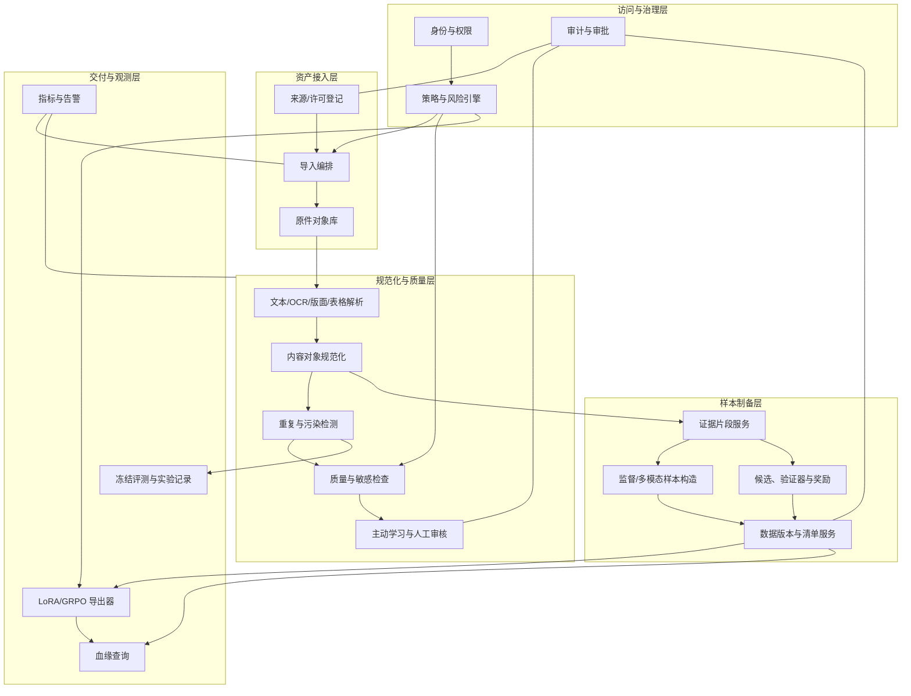
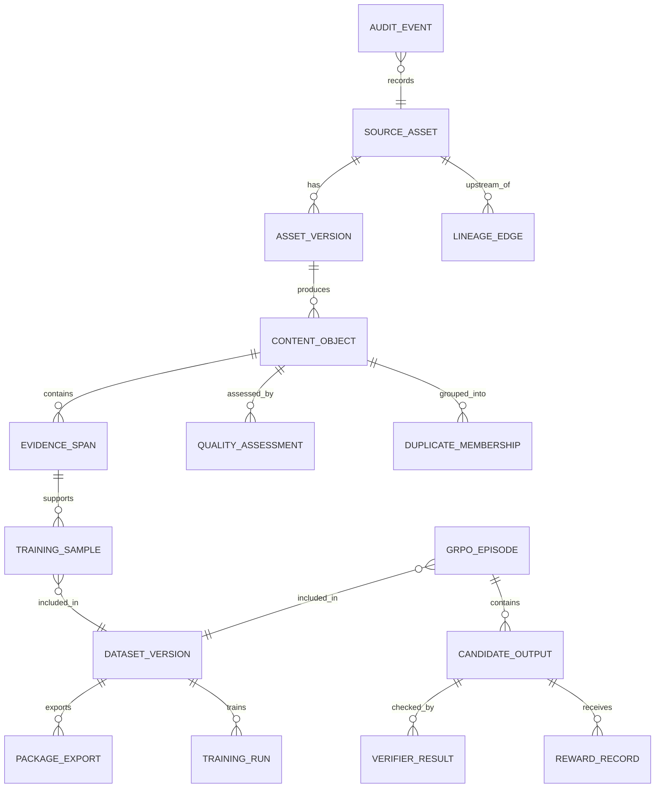
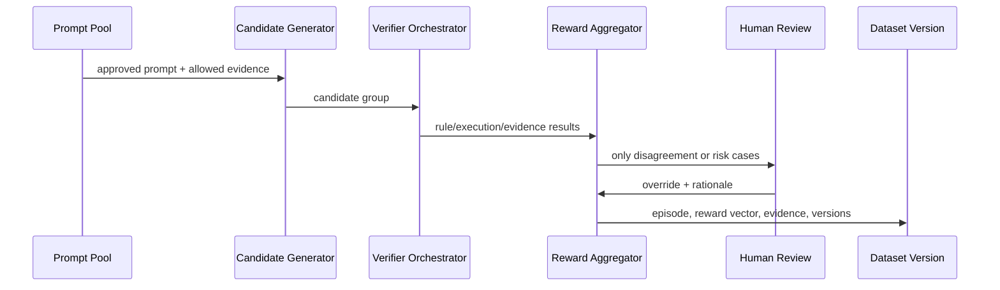

# 受控领域训练数据制备平台软件设计说明书

**版本**：0.1
**日期**：2026-09-08
**文档类型**：Software Design Description, SDD

## 1. 设计目标

平台以“可追溯、可验证、可撤回、低人工成本”为核心，提供受控领域模型训练数据制备能力。设计目标是以可组合服务将原始授权资产转化为 LoRA 和 GRPO 两类可复现训练工件，并在每一环嵌入策略门禁和审计。

非目标：模型在线推理、作战/行动辅助、目标识别、未经授权采集、避开安全审查的内容处理。

## 2. 架构原则

1. **不可变原件，派生版本化。** 原始资产只追加，不覆盖；解析、清洗、标注、合成产生新版本。
2. **策略先于计算。** 许可、用途、隐私和禁止类别检查在解析、样本构造和导出三个关口执行。
3. **证据先于答案。** 样本、奖励与人工结论必须绑定可定位证据。
4. **数据和模型一一可追。** 数据版本、配置、评测、LoRA 适配器和 GRPO 运行通过清单哈希关联。
5. **自动化处理确定性，人工处理不确定性。** 规则、哈希和可执行验证器优先；人工用于分歧、边界和高价值难例。
6. **评测隔离不可绕过。** 训练流程只读可用训练分割，测试标签通过权限和服务边界隔离。

## 3. 逻辑架构



## 4. 部署视图

### 4.1 服务分区

| 分区 | 组件 | 安全要求 |
|---|---|---|
| 控制平面 | IAM、策略、审批、元数据、审计、配置 | 最小权限、强认证、配置版本化、审计不可改写。 |
| 数据平面 | 原件对象库、内容库、向量索引、关系库、缓存 | 加密、分级访问、源资产与派生资产逻辑隔离。 |
| 计算平面 | 导入、OCR、解析、去重、质量、导出任务 Worker | 短期凭据、作业级数据权限、无默认外网写出。 |
| 审核平面 | 人工审核 UI、标注队列、仲裁工作台 | 仅显示完成脱敏和权限裁剪的内容，操作全审计。 |
| 训练集成平面 | LoRA/GRPO 工件导出、实验记录回写 | 只传输批准的数据包和必要配置，不直连原件库。 |

### 4.2 推荐实现形态

- API 网关 + 领域服务；
- 对象存储保存原件、渲染页和版本化工件；
- 关系数据库保存元数据、状态机、审批和血缘边；
- 向量索引保存用于近重复和检索的向量，不作为唯一事实来源；
- 消息队列驱动长任务，保证幂等重试；
- 工作流编排器管理批处理 DAG；
- OpenTelemetry 类指标/日志/追踪组件记录作业和策略结果；
- OpenLineage 兼容事件记录 Dataset、Job、Run 的 START/COMPLETE/FAIL 及 input/output/schema facet。

具体产品选型在实施阶段依据组织已有基础设施、隔离要求和许可条件确定。设计不依赖某一云厂商或特定模型供应商。

## 5. 核心数据模型

### 5.1 实体关系



### 5.2 关键表字段

| 表 | 关键字段 | 说明 |
|---|---|---|
| source_asset | asset_id, provider, source_uri, raw_hash, license_id, allowed_use, sensitivity_tier, lifecycle_status | 来源与合规事实。 |
| asset_version | version_id, asset_id, parent_version, storage_ref, transform_id, transform_version | 原件及每次派生版本。 |
| content_object | content_id, version_id, modality, language, normalized_hash, parser_confidence, policy_status | 规范化内容对象。 |
| evidence_span | evidence_id, content_id, locator_json, rendered_ref, canonical_text, confidence | 页面/段落/单元/图区域定位。 |
| quality_assessment | assessment_id, object_id, rule_snapshot, scores_json, decision, evidence_json | 质量和政策判定。 |
| pii_finding | finding_id, object_id, entity_type, locator, confidence, detector_version, action, review_state | PII 发现、处理与复核。 |
| data_contract | contract_id, version, schema_assertions, freshness_assertions, quality_assertions, failure_policy | 数据契约与断言版本。 |
| reward_spec | reward_spec_id, verifier_refs, judge_prompt_ref, weights, thresholds, hard_constraints, version | 可回放奖励规范。 |
| training_sample | sample_id, task_type, input_refs, evidence_refs, target, split, status | LoRA/监督样本。 |
| grpo_episode | episode_id, prompt_ref, context_refs, candidate_group_id, reward_policy_version | GRPO 任务容器。 |
| candidate_output | candidate_id, episode_id, output_ref, safety_status, generation_config | 同提示的候选输出。 |
| verifier_result | verifier_result_id, candidate_id, verifier_id, verifier_version, result, evidence_ref | 可回放验证证据。 |
| dataset_version | dataset_id, manifest_hash, policy_snapshot_hash, split_hashes, approval_state | 冻结数据集版本。 |
| lineage_edge | from_id, to_id, relation, transform_version, timestamp | 跨资产、样本、数据包和模型的关系。 |

### 5.3 状态机

```text
REGISTERED -> LICENSE_VERIFIED -> INGESTED -> NORMALIZED -> CHECKED
CHECKED -> QUARANTINED | REVIEW_PENDING | CANDIDATE
REVIEW_PENDING -> REJECTED | CANDIDATE
CANDIDATE -> SAMPLE_BUILT -> CONTAMINATION_CHECKED -> VERSION_FROZEN
VERSION_FROZEN -> APPROVED -> EXPORTED -> TRAINED
任意非终态 -> WITHDRAWN 或 QUARANTINED
```

状态转移由策略服务授权，任何审批或人工覆盖都写入 AuditEvent。

## 6. 模块设计

### 6.1 来源与许可服务

**职责**：管理来源登记、许可凭证、用途限制、责任人、保留期和撤回状态。

**输入**：来源 URI 或提供方信息、许可/合同编号、用途、资产清单。
**输出**：`asset_id`、政策快照、可导入或隔离结论。
**关键规则**：许可未知、用途冲突、来源不可信或超出保留期时返回阻断状态。

### 6.2 导入与原件保险库

**职责**：接收文件/批量清单，生成内容哈希，保存不可变原件和入库事件。

**设计要点**：

- 原件以内容寻址方式存储，派生文件不覆盖原件；
- 导入作业使用幂等键 `asset_id + raw_hash + import_profile_version`；
- 每个对象带清晰的保留、隔离、加密和访问标签；
- 仅允许批准的连接器/人工上传进入该边界。

### 6.3 解析与多模态规范化服务

**职责**：文本抽取、OCR、页渲染、版面识别、表格解析、图注关联和内容对象生成。

**插件契约**：

```json
{
  "parser_id": "string",
  "parser_version": "string",
  "input_asset_version": "string",
  "outputs": [
    {
      "content_type": "text|page|layout|table|image|caption",
      "storage_ref": "string",
      "locator": "json",
      "confidence": 0.0,
      "warnings": ["string"]
    }
  ]
}
```

**质量策略**：低置信 OCR、阅读顺序异常、表格跨页、图注缺失和页损坏不直接抛弃，而是进入复核优先级模型。

### 6.4 策略、隐私与质量引擎

**职责**：对资产、内容对象、样本和导出请求执行同一套可版本化规则。

**策略优先级**：

1. 硬阻断：无授权、禁止用途、禁止类别、已撤回、明确隐私违规；
2. 隔离复核：许可不完整、模型高不确定、信息冲突、低质量高价值候选；
3. 自动采纳：所有硬规则通过，且质量/去重/评测隔离满足阈值；
4. 降级处理：不能作为正向训练数据但可转为拒答、边界说明或错误检测样本。

策略结果采用结构化格式：`decision`、`reason_codes[]`、`evidence_refs[]`、`policy_version`、`review_required`。PII 检测结果另存发现项定位、实体类型、置信度、检测器版本、红删/替换/隔离动作和人工复核状态；低置信或高敏实体不得仅凭自动检测放行。

### 6.5 去重与评测污染检测服务

**职责**：识别精确重复、文本近重复、图像近重复、跨模态重复及训练-评测交叉污染。

**四级流程**：

1. 内容哈希：快速精确重复拦截；
2. 归一化文本 n-gram / MinHash：候选文本近重复召回；
3. 向量相似度：语义近重复与跨模态候选召回；
4. 高相似边界人工确认：避免误杀高价值相似事实或漏放评测泄漏。

评测集的原始标签与答案字段不下发给普通筛选 Worker；污染检测服务只返回允许/阻断及最小必要匹配证据。

### 6.6 证据与样本构造服务

**职责**：从已批准内容对象创建可验证监督样本。

**样本模板**：

- `extract`: 证据 -> 指定 schema；
- `cite_qa`: 问题 + 指定证据 -> 答案 + 引用；
- `compare`: 两个经授权版本 -> 差异表；
- `summarize`: 指定章节 -> 限定范围摘要 + 覆盖检查；
- `correct`: 错误断言 + 证据 -> 更正/不确定性说明；
- `abstain`: 证据不足或用途受限 -> 边界说明/升级建议。

模板构造时必须保存 `template_version`、输入证据 ID、目标字段验证结果与样本创建人/作业 ID。

### 6.7 主动审核与标注服务

**职责**：把有限人工预算投向影响最大的对象。

**优先级特征**：解析置信度低、多个模型结论分歧、验证器结果冲突、来源风险高、样本稀有度高、代表性高、拟用于评测或奖励的影响高。

**双人机制**：

- 普通样本可单人标注 + 抽检；
- 高影响或高风险样本要求双人独立标注；
- 分歧进入仲裁，仲裁结论可回写规则/黄金集；
- 人工只能修改派生标签或状态，不改写原件。

### 6.8 GRPO 奖励服务

**职责**：管理候选组、验证器、奖励向量、组内比较和回放。

**数据流**：



**奖励计算**：

`reward_vector = {evidence, factuality, structural_validity, boundary_compliance, presentation}`

`scalar_reward` 由已冻结的权重和硬约束产生。边界合规失败优先于其他高分；任何硬约束失败均不进入正向更新。组内相对处理由训练框架完成，但平台必须保留候选组、原始奖励和归一化前依据。

### 6.9 数据版本和导出服务

**职责**：冻结样本清单、规则版本、分割哈希和审批状态，产生 LoRA/GRPO 工件。

**导出前置检查**：

- 每个样本具备来源、证据、许可和状态；
- 训练/验证/测试污染检查通过；
- 不包含撤回或隔离对象；
- 数据卡、质量报告和审批记录存在；
- 请求方有该数据包用途的权限。

**LoRA 导出内容**：JSONL/Parquet 样本、manifest、adapter 配置模板、split hash、数据卡、质量报告。
**GRPO 导出内容**：提示、上下文引用、候选组、验证器结果、奖励向量、奖励证据、`RewardSpec`、策略快照、过滤报告。

数据契约在导出时必须同时校验 schema、freshness 和 quality assertions。断言失败按契约规定执行阻断、隔离或告警，并把断言版本和证据写入 manifest。生产 trace 只能先经脱敏和抽样进入独立评测集，人工确认后再按审批结果进入训练候选，不得直接回流训练。

## 7. 外部接口设计

接口采用版本化 REST 或 gRPC 实现，以下为逻辑契约。

| 接口 | 方法 | 描述 |
|---|---|---|
| `/v1/assets` | POST | 登记源资产与许可信息。 |
| `/v1/assets/{id}/ingest` | POST | 创建导入作业。 |
| `/v1/assets/{id}/lineage` | GET | 查询源资产到样本/模型的血缘图。 |
| `/v1/content/{id}/assessments` | GET | 获取质量、策略和去重结论。 |
| `/v1/review-queues/{queue}` | GET | 获取按权限裁剪后的审核队列。 |
| `/v1/reviews/{id}` | POST | 提交审核/仲裁结论。 |
| `/v1/samples` | POST | 从已批准证据构造监督样本。 |
| `/v1/grpo/episodes` | POST | 创建 GRPO 提示和候选组记录。 |
| `/v1/grpo/episodes/{id}/replay` | POST | 使用固定版本验证器回放奖励。 |
| `/v1/datasets` | POST | 创建冻结数据版本。 |
| `/v1/datasets/{id}/approve` | POST | 走审批门禁。 |
| `/v1/datasets/{id}/exports` | POST | 生成 LoRA/GRPO 导出工件。 |
| `/v1/withdrawals` | POST | 提交撤回并启动影响分析。 |
| `/v1/metrics` | GET | 查询质量、成本、训练收益和风险指标。 |

所有写接口必须传递身份、用途声明和幂等键；所有读接口按对象敏感等级和角色过滤字段。

## 8. 安全与治理设计

### 8.1 身份和权限

- 使用集中身份源和 RBAC/ABAC 混合授权；
- 资产访问需同时满足角色、数据级别、用途和项目归属；
- 训练导出服务只能读取已经批准且用途匹配的派生数据；
- 测试标签、许可凭证、原件和审计日志分别划分最小访问面。

### 8.2 密钥和数据保护

- 传输和静态数据加密，密钥由专用密钥管理服务托管；
- 对象存储采用版本化、保留策略与访问日志；
- 人工审核界面按需渲染，避免下载全量原件；
- 任务 Worker 采用短期凭据、最小临时目录、自动清理和网络出口限制。

### 8.3 审计与不可抵赖

每条审核、导出、政策覆盖、撤回和审批事件包含：操作者、角色、用途、对象 ID、前后状态、规则版本、理由、时间戳和关联工单。审计事件写入追加型存储，并定期校验哈希链完整性。

## 9. 可观测性和运营指标

| 指标组 | 示例 |
|---|---|
| 作业健康 | 导入成功率、OCR 失败率、解析排队时长、重试次数。 |
| 数据质量 | 去重率、OCR 置信度、图文对齐率、标注一致率、污染命中率。 |
| 治理 | 许可完整率、阻断原因分布、审批时长、撤回影响范围。 |
| 成本 | 单位通过样本成本、人工审核单位成本、GPU/CPU 每样本成本、缓存命中率。 |
| 训练效益 | 冻结评测增益、回归数、每评测点成本、各数据策略排名。 |
| 奖励健康 | 验证器分歧率、人工推翻率、奖励漂移、候选通过率。 |

告警原则：出现禁止类别漏检、评测污染、许可过期、撤回影响未处理、奖励分布异常或审计链异常时，自动停止对应数据版本的后续导出。

## 10. 故障处理与恢复

| 场景 | 处理策略 |
|---|---|
| 导入/解析失败 | 作业幂等重试；保留失败证据；超过阈值进入人工诊断。 |
| 规则或模型升级 | 新版本只影响后续判定；旧结论可回放；高风险变更触发历史批次重评。 |
| 检出评测污染 | 冻结相关数据版本和实验结论，记录污染来源，清除后重新评估。 |
| 许可撤回 | 停止导出，计算影响图，标记受影响模型/数据包，按政策决定再训练或限制使用。 |
| 验证器故障 | GRPO 包不发布；保留候选和原始证据，等待验证器恢复后回放。 |
| 审计异常 | 阻断高风险操作，启动完整性核验和安全事件流程。 |

## 11. 测试策略

### 11.1 单元与契约测试

- 每个解析器、规则、验证器、导出器具备版本化样例；
- 对接口的鉴权、幂等、字段过滤和状态机做契约测试；
- 使用固定黄金文档验证 OCR、版面、表格和图文绑定结果。

### 11.2 集成测试

- 从来源登记到 LoRA/GRPO 导出的全链路回放；
- 训练-评测近重复和撤回影响分析；
- 多角色权限隔离；
- 规则升级后历史版本不被意外改写。

### 11.3 质量与安全测试

- 使用专门构造的无授权、隐私、用途冲突、评测泄漏和多模态冲突样本验证硬阻断；
- 对审核队列做一致率、误拒率和漏检率评估；
- 对审计日志做篡改检测与灾备恢复演练；
- 对 GRPO 验证器做回放一致性、分歧监控和人工推翻分析。

## 12. 实施分期

| 阶段 | 重点交付 |
|---|---|
| P0 基础治理 | 身份、来源台账、原件存储、许可/用途策略、审计。 |
| P1 文本与文档 MVP | 导入、OCR、解析、去重、污染检测、审核队列、LoRA 导出。 |
| P2 多模态与质量闭环 | 图文/表格内容对象、主动学习、质量模型、数据卡和指标看板。 |
| P3 GRPO 数据闭环 | 候选组、规则验证器、奖励回放、人工覆盖、GRPO 导出。 |
| P4 规模化运营 | 成本优化、策略 A/B、撤回自动化、训练收益回写和持续重评。 |

每个阶段必须通过合规、数据质量、可复现性和撤回演练门禁后再进入下一阶段。
