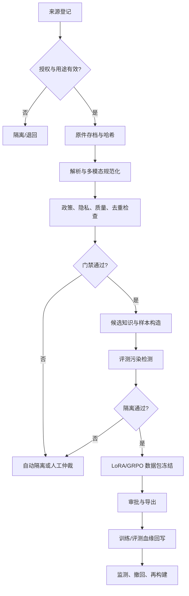

# 受控领域训练数据制备平台软件需求规格说明书

**版本**：0.1
**日期**：2026-09-08
**文档类型**：Software Requirements Specification, SRS

## 1. 目的

本规格定义“受控领域长链推理模型训练数据制备平台”的功能、数据、质量、合规、安全和验收要求。平台用于将具备明确授权的文本、多模态文档和结构化资料制作为可追溯训练数据，向 LoRA 领域适配和 GRPO 后训练提供版本化数据包。

平台不承担实时决策、行动规划、目标选择、武器运用、未授权情报处理或任何高风险用途的自动化能力。

## 2. 范围

### 2.1 本期覆盖

- 受控来源登记、授权与许可管理；
- 文本、PDF/扫描页、图像、表格、图文配对的导入与规范化；
- OCR、版面解析、表格结构化、元数据提取；
- 隐私、版权、敏感用途和数据质量的自动检查与人工仲裁；
- 精确去重、近重复去重、训练/评测污染检测；
- 监督样本、证据型问答、结构化任务、多模态样本和拒答样本构造；
- GRPO 的提示、候选、验证器、奖励和人工覆盖记录管理；
- 数据集版本、训练包导出、评测隔离、模型-数据血缘追踪；
- 指标看板、审计、撤回、再构建和审批流。

### 2.2 明确不覆盖

- 高风险或敏感军事行动数据处理；
- 直接输出行动建议、目标优先级、部署方案或武器使用建议；
- 未经授权的网络采集、规避访问控制或绕过版权限制；
- 在无人工审批情况下将生产用户数据自动并入训练集；
- 通用大模型训练集群调度、模型推理服务和面向最终用户的聊天应用。

## 3. 术语

| 术语 | 定义 |
|---|---|
| 源资产 | 原始文档、图像、表格或其他具备来源和许可信息的输入对象。 |
| 证据片段 | 可定位到源资产特定页、段、表格单元或图像区域的内容单元。 |
| 数据卡 | 记录数据集来源、用途、处理、质量、限制、风险和责任人的说明。 |
| 数据包 | 面向一次训练运行冻结的样本清单、配置、质量报告和哈希集合。 |
| LoRA 包 | 用于领域继续预训练或监督适配的数据包及适配器配置。 |
| GRPO 包 | 包含提示、候选组、验证器输出、奖励和回放信息的后训练数据包。 |
| 评测污染 | 训练数据与验证/测试数据存在文本、图像、语义或结构近重复，导致评测不可信。 |
| 撤回 | 因许可、质量、风险或用户请求使源资产和派生样本退出后续训练使用的过程。 |

## 4. 参与角色

| 角色 | 权限与责任 |
|---|---|
| 数据管理员 | 登记来源、维护许可、设置数据保留与撤回策略。 |
| 数据工程师 | 配置导入、解析、去重、质量规则和数据导出。 |
| 领域审核员 | 审核高不确定、冲突、敏感边界和高价值样本。 |
| 标注员 | 完成受控任务的证据标注、结构化标注和双人复核。 |
| 训练工程师 | 创建 LoRA/GRPO 数据包，关联训练与评测报告。 |
| 合规/安全审核员 | 审核许可、隐私、用途限制、风险分级和发布门禁。 |
| 审计员 | 只读访问血缘、审批、导出和撤回记录。 |
| 平台管理员 | 维护身份、角色、策略、密钥、审计和系统配置。 |

所有角色遵循最小权限原则。未经显式授权，训练工程师不得访问原始受限资产，标注员不得修改许可或导出训练包。

## 5. 业务流程

## 6. 功能需求

### 6.1 来源和合规管理

| ID | 需求 | 验收标准 |
|---|---|---|
| FR-01 | 系统必须支持源资产登记，包含来源 URL/提供方、获取时间、许可/授权凭证、允许用途、保留期、责任人和风险等级。 | 缺少任一必填合规字段的源资产不可进入解析队列。 |
| FR-02 | 系统必须以内容哈希保存原件不可变身份，并保留原件、派生版本和转换参数的血缘。 | 任一训练样本可在单次查询中追溯到源资产和原件哈希。 |
| FR-03 | 系统必须支持用途限制与风险标签，至少包括公开可用、内部授权、待确认、禁止训练、需人工审批。 | 标记为待确认/禁止训练的资产不能被导出到训练包。 |
| FR-04 | 系统必须支持撤回请求、影响范围计算和停止后续导出。 | 撤回后能列出受影响样本、数据包、训练运行和模型版本。 |
| FR-05 | 系统必须保存审批、导出、规则命中、人工覆盖和撤回操作的不可抵赖审计记录。 | 审计记录含操作者、时间、对象、前后状态和原因。 |

### 6.2 导入、解析和多模态规范化

| ID | 需求 | 验收标准 |
|---|---|---|
| FR-06 | 系统必须支持文本、HTML、PDF、扫描件、图像、CSV/JSON 和表格型文档导入。 | 每种类型均可生成标准化资产记录或明确失败原因。 |
| FR-07 | 系统必须支持 OCR、页级渲染、段落/标题/表格/图像块切分及阅读顺序重建。 | 每个解析结果保留原件页码/坐标和解析器版本。 |
| FR-08 | 系统必须将图像、OCR 文本、版面块、表格结构、图注和来源关联为统一多模态内容对象。 | 从一个内容对象可跳转到其全部模态及对应源位置。 |
| FR-09 | 系统必须记录解析置信度、失败原因和人工修订版本。 | 低于配置阈值的 OCR/表格结果自动进入待复核队列。 |

### 6.3 政策、质量和去重

| ID | 需求 | 验收标准 |
|---|---|---|
| FR-10 | 系统必须在导入和导出前执行隐私、许可、敏感用途和禁止类别策略检查。 | 命中阻断策略的对象不可进入训练候选集。 |
| FR-11 | 系统必须支持精确哈希去重、文本近重复、图像近重复和跨模态重复簇。 | 样本可查看重复簇 ID、代表样本和保留/排除理由。 |
| FR-12 | 系统必须支持可配置质量评分，包括完整性、可读性、语言、结构、证据性、图文一致性和标注置信度。 | 导出清单包含各样本质量维度和采用阈值。 |
| FR-13 | 系统必须对训练、验证、测试和回归集执行污染检测。 | 已确认训练-评测重叠为零，否则阻断数据包发布。 |
| FR-14 | 系统必须支持规则、轻量判别模型与人工仲裁组合的策略执行。 | 每个处理结论均显示触发规则/模型版本或人工理由。 |

### 6.4 样本构造和标注

| ID | 需求 | 验收标准 |
|---|---|---|
| FR-15 | 系统必须支持从证据片段构造监督样本，至少覆盖摘要、引用问答、结构化抽取、对比、纠错和拒答。 | 样本中包含任务模板、证据位置、答案和可验证字段。 |
| FR-16 | 系统必须支持文本、图像、表格和图文混合输入的样本定义。 | 样本可声明模态、输入引用、渲染顺序和预处理策略。 |
| FR-17 | 系统必须支持双人标注、分歧仲裁、黄金样本和标注质量统计。 | 可计算标注一致率、仲裁率、审核通过率。 |
| FR-18 | 系统必须支持主动学习队列，按模型不确定性、验证器分歧、OCR 低置信、重复簇边缘和风险等级排序。 | 队列排序规则可配置且每项可解释。 |
| FR-19 | 系统必须支持受证据约束的合成候选生成与自动验证。 | 无来源、无验证证据或命中禁止类别的合成候选不得转正。 |

### 6.5 LoRA 数据包

| ID | 需求 | 验收标准 |
|---|---|---|
| FR-20 | 系统必须按数据版本、任务类型、模态、质量阈值和许可条件筛选 LoRA 样本。 | 导出可复现相同样本清单和排序。 |
| FR-21 | 系统必须记录基座模型、适配器配置、序列化/截断策略、训练/验证/测试分割和数据哈希。 | 训练工程师可依据清单重新构建完全一致的数据包。 |
| FR-22 | 系统必须支持独立领域/任务数据版本与 LoRA 适配器的关联。 | 可从任意适配器反查训练数据、评测结果和审批记录。 |

### 6.6 GRPO 数据包和奖励

| ID | 需求 | 验收标准 |
|---|---|---|
| FR-23 | 系统必须支持 GRPO 提示、上下文、候选组、验证器输出、奖励向量和标量奖励记录。 | 每一组候选具备相同提示、组 ID 和完整验证证据。 |
| FR-24 | 系统必须支持规则、可执行检查、基于证据的判别器和人工裁决组成的奖励管线。 | 奖励可回放，回放时固定验证器/规则版本。 |
| FR-25 | 系统必须将安全、隐私、许可和用途边界设为奖励硬约束。 | 触发硬约束的候选不可获得正向奖励，且被隔离或转为拒答样本。 |
| FR-26 | 系统必须支持奖励漂移与验证器分歧监控。 | 平台可按版本显示奖励分布、分歧率、人工推翻率和异常提示。 |

### 6.7 评测、发布和观测

| ID | 需求 | 验收标准 |
|---|---|---|
| FR-27 | 系统必须维护冻结验证集、测试集、回归集和风险集，并限制训练人员直接查看测试标签。 | 权限审计可证明测试标签未被训练导出流程读取。 |
| FR-28 | 系统必须支持固定训练预算下的数据策略对照实验记录。 | 每次实验关联相同基座、预算、评测集和数据版本。 |
| FR-29 | 系统必须展示数据质量、成本、训练收益、污染、审批和撤回指标。 | 支持按数据版本、来源、模态、任务和时间筛选。 |
| FR-30 | 系统必须支持 Go/No-Go 发布审批和一键停止后续导出。 | 未批准的数据包不能生成可训练工件。 |

## 7. 数据需求

### 7.1 核心实体

| 实体 | 必填属性 | 说明 |
|---|---|---|
| SourceAsset | id, uri/provider, raw_hash, license, allowed_use, owner, status | 原始来源及授权状态。 |
| ContentObject | id, asset_id, modality, language, content_hash, parser_version | 标准化内容对象。 |
| EvidenceSpan | id, content_id, locator, text_or_region, confidence | 可定位证据单元。 |
| QualityAssessment | object_id, rule_version, scores, decision, evidence | 自动/人工质量结论。 |
| TrainingSample | id, dataset_version, input_refs, evidence_refs, target, task_type, status | LoRA 或监督样本。 |
| GRPOEpisode | id, prompt, candidate_group, rewards, verifier_refs, policy_version | GRPO 训练单元。 |
| DatasetVersion | id, manifest_hash, policy_snapshot, split_hashes, approval_status | 不可变数据版本。 |
| LineageEdge | parent_id, child_id, transform, transform_version, operator | 血缘关系。 |
| AuditEvent | actor, action, object, time, before, after, reason | 审计事件。 |

### 7.2 数据保留规则

- 原件与许可凭证按来源约定、组织策略和法律要求保留；
- 派生样本的保留不得超出源资产允许用途和保留期限；
- 撤回后停止新训练包导出，并标记已有训练/模型影响范围；
- 日志只保留必要字段，避免记录原始敏感文本和不必要个人信息；
- 数据版本不直接物理覆盖，采用状态变更和可审计删除/隔离策略。

## 8. 非功能需求

| ID | 类别 | 要求 |
|---|---|---|
| NFR-01 | 可追溯性 | 已发布数据包的样本血缘完整率必须为 100%。 |
| NFR-02 | 安全 | 使用组织身份认证、角色权限、传输/存储加密、密钥托管和审计。 |
| NFR-03 | 隐私 | 导入、解析、导出和日志均执行最小化与策略检查。 |
| NFR-04 | 可复现性 | 同一原件、规则、模型和版本配置应能重建相同数据包清单。 |
| NFR-05 | 可用性 | 核心元数据和审批服务应具备备份、恢复和故障告警机制。 |
| NFR-06 | 性能 | 批处理吞吐、解析时延和看板查询目标以试点规模基线确定；不得牺牲门禁完整性换取速度。 |
| NFR-07 | 可扩展性 | 解析器、质量规则、验证器和导出器以插件契约扩展。 |
| NFR-08 | 可解释性 | 每个阻断、采纳、奖励和人工覆盖结果均可查看依据。 |
| NFR-09 | 可观测性 | 支持作业、队列、模型版本、规则命中、成本和数据漂移的结构化指标。 |
| NFR-10 | 可靠性 | 失败作业可幂等重试；原件与已批准数据版本不可被后台任务覆盖。 |

## 9. 关键验收场景

1. **来源不完整阻断：** 创建缺少许可证的源资产，系统必须拒绝进入解析/训练候选队列。
2. **多模态可追溯：** 导入一份经授权扫描文档，能够从一个训练样本回溯到原页、OCR、表格结构、人工修订和许可记录。
3. **污染阻断：** 将与测试集相同或近重复的文本/图像加入训练候选，系统必须标记并阻止发布。
4. **主动学习闭环：** OCR 低置信且多模型分歧的对象应进入审核队列；审核结论更新质量模型/规则版本。
5. **GRPO 回放：** 对一个 GRPO 候选组可复放验证器，获得相同奖励证据和结果。
6. **撤回影响分析：** 撤回一个源资产后，系统能列出所有受影响样本、数据版本、训练运行和适配器。
7. **导出可复现：** 依据已批准数据包清单重建，样本 ID、顺序、分割哈希和配置一致。
8. **用途边界：** 输入或样本命中禁止类别时，系统必须隔离，不导出、不正向奖励，并留下审计事件。

## 10. 最小可行版本（MVP）

MVP 优先实现：

- 来源登记、许可/用途状态、原件哈希和血缘；
- PDF/文本/图像导入，OCR 和基础版面解析；
- 规则式敏感检查、精确/近重复检测、评测集隔离；
- 证据型监督样本构造、人工审核队列；
- LoRA 数据包冻结与导出；
- 规则验证器驱动的最小 GRPO 数据包；
- 审批、审计、撤回影响查询和核心指标看板。

MVP 不包含自动化高风险内容分类决策、不受控网页抓取、端到端训练集群、通用智能体执行能力或面向外部用户的推理服务。

## 11. 需求追溯

本 SRS 的治理、来源、隐私、上线审批和持续监测要求与 NIST AI RMF 的 Govern、Map、Measure、Manage 思路对齐；数据筛选、固定预算试验与污染隔离参考 DataComp；LoRA、过程监督和 GRPO 数据结构参考公开研究结论。详见《受控领域长链推理模型训练数据制备方法论》。
